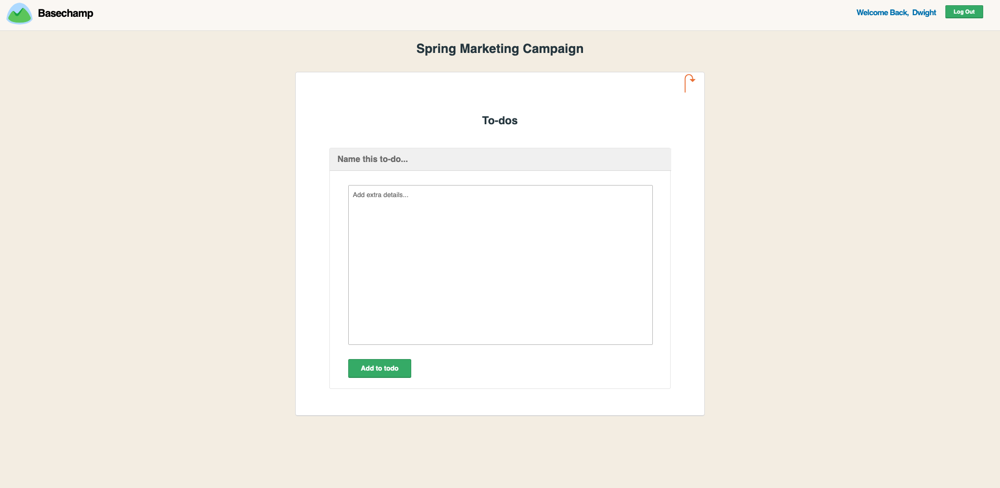

# Basechamp

Instead of having stuff scattered all over the place — strewn across separate products, lost in inboxes, or scrawled on stickies or notepads — [Basechamp](https://basechamp.onrender.com/#/) brings all the projects your company’s working on under one roof. Organized, centralized, and clear so everyone knows what to do, everyone knows where things stand, and everyone can get what they need without having to ask around all the time.

[Basechamp Live Site](https://basechamp.onrender.com/#/)

[Basechamp Wiki](https://github.com/ckane30691/Basechamp/wiki)

## Site Features:

## Dashboard

Lays all your current projects out for you to view

## Events

Lists all the events for a particular project

View an event

## Message Board

See Messages Posted About a Project

## Todos

Add Todos for a project

## Spotted a bug?

If you find a bug, please open an issue [here](https://github.com/ckane30691/Basechamp/issues/new).

## Technologies Used:

- [Ruby on Rails](http://rubyonrails.org/) - Server-side MVC Framework
- [PotsgreSQL](https://www.postgresql.org/) - Database management system
- [React](https://reactjs.org/) - JS library for building user interfaces
- [Redux](http://redux.js.org/) - Frontend architecture for giving apps a predictable state

## Future Directions for Basechamp

- Implement Teams
- Implement User Profile
- Implement User Search
